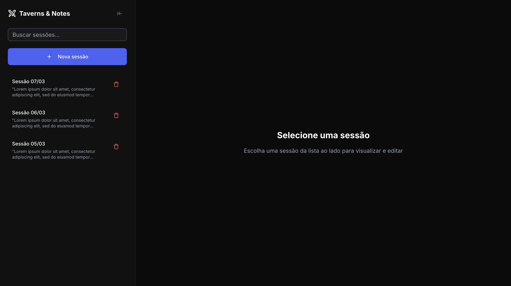

<p align="center">
  <h3 align="center">Taverns&Notes</h3>
</p>

<p align="center">
  Organize tabletop RPG campaigns, sessions and notes in one place.
</p>

<p align="center">
  <a href="https://taverns-notes.vercel.app/">Live Demo</a> •
  <a href="#features">Features</a> •
  <a href="#installation">Installation</a>
</p>

<p align="center">
  
  
  
  
  
</p>

---

## 📖 About The Project

Taverns&Notes is a web application designed to help tabletop RPG groups organize their campaigns.

Game Masters and players can register campaigns, store session notes and keep track of important information from their adventures.

The goal of the project is to keep campaign history organized and prevent important details from getting lost between sessions.

## 📚 Table of Contents

- [📖 About The Project](#-about-the-project)
- [📚 Table of Contents](#-table-of-contents)
- [🖥 Usage](#-usage)
- [⚙️ Features](#️-features)
- [🖼 Screenshots](#-screenshots)
- [🗺 Roadmap](#-roadmap)
- [🧰 Technologies](#-technologies)
- [🚀 Installation](#-installation)
- [🧪 Running Tests](#-running-tests)
- [📜 Available Scripts](#-available-scripts)
- [📁 Project Structure](#-project-structure)
- [🤝 Contributing](#-contributing)
- [📄 License](#-license)
- [👩‍💻 Author](#-author)

## 🖥 Usage

You can try the application here:

https://taverns-notes.vercel.app/

With taverns-notes you can:

<!-- - Create RPG campaigns
- Register campaign sessions -->

- Write and organize session notes
<!-- - Store important campaign information in one place -->

The application helps groups keep their story and session history organized.

## ⚙️ Features

Current features:

<!-- - Campaign creation -->
<!-- - Session management -->

- Session notes
<!-- - Campaign organization -->

## 🖼 Screenshots

Screenshots of the application will be added here.

### Sessions



## 🧰 Technologies

Main technologies used in this project:

- Next.js
- React
- TypeScript
- Prisma
- PostgreSQL
- TailwindCSS
- Radix UI
- Zod
- Playwright
- Jest

## 🗺 Roadmap

Planned improvements for future versions:

- [ ] Campaign creation
- [x] Session notes
- [ ] Authentication
- [ ] Campaign sharing
- [ ] Markdown support for notes
- [ ] Export session notes
- [ ] Mobile improvements

## 🚀 Installation

### Clone the repository

```bash
git clone https://github.com/3salles/taverns-notes.git
cd taverns-notes
```

### Install dependencies

```bash
pnpm install
```

### Run the project

```bash
pnpm dev
```

http://localhost:3000

## 📜 Available Scripts

| Command                 | Description              |
| ----------------------- | ------------------------ |
| pnpm dev                | Start development server |
| pnpm build              | Build production version |
| pnpm start              | Run production build     |
| pnpm lint               | Run ESLint               |
| pnpm test               | Run automated tests      |
| pnpm prisma generate    | Generate Prisma client   |
| pnpm prisma migrate dev | Run database migrations  |

## 📁 Project Structure

```bash
taverns-notes
│
├─ docs
│  ├─ architecture.md
│  ├─ preview.png
│  ├─ demo.gif
│  └─ images
│     ├─ campaigns.png
│     └─ sessions.png
│
├─ prisma
├─ src
├─ tests
│
├─ .env.example
├─ README.md
├─ LICENSE
└─ package.json
```

## 🤝 Contributing

1. Fork the repository
2. Create a branch

```bash
git checkout -b feature/my-feature
```

3. Commit your changes

```bash
git commit -m "add my feature"
```

4. Run tests before opening a PR

```bash
pnpm test
```

5. Push the branch

```bash
git push origin feature/my-feature
```

## 📄 License

This project is licensed under the MIT License.

## 👩‍💻 Author

[Beatriz Salles](https://github.com/3salles)
